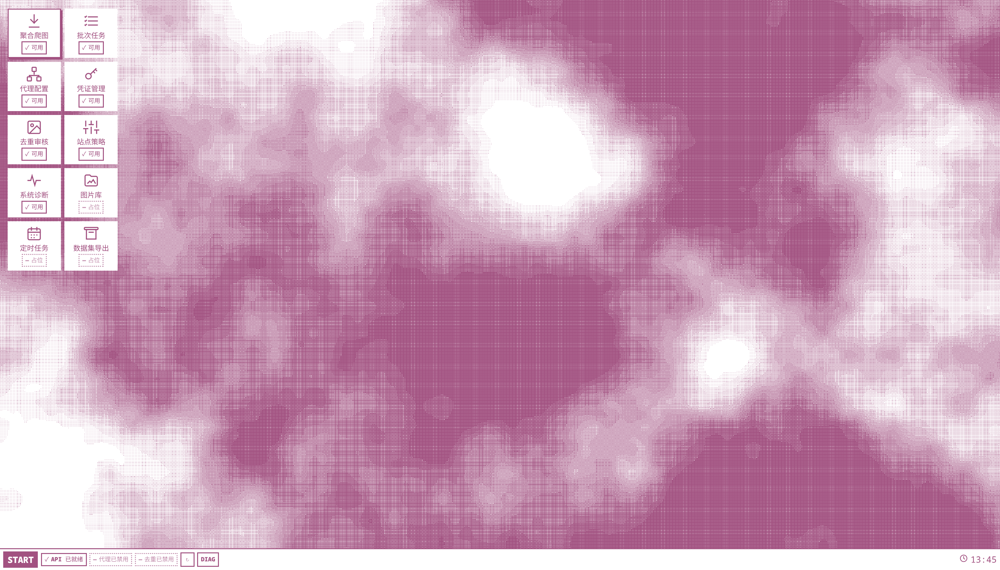

# ImageWeave



ImageWeave 是一套面向插画与图库采集的本地工作台。它把跨站来源发现、gallery-dl 批次下载、
代理池、站点授权、任务恢复和 L0–L2 图片去重整合到同一个桌面式 WebUI 中。

- 支持 Danbooru、X / Twitter、Pixiv、E-Hentai / ExHentai 与 Pawchive；
- WebUI、API 与任务调度器全部在本机运行，默认只监听 `127.0.0.1`；
- 前端随后端直接提供，不需要 Node.js、npm 或单独的前端服务；
- Linux 和 Windows 使用相同的配置格式与工作流；
- 下载代理池、安装代理和授权浏览器代理相互隔离。

## 软件与功能

### 桌面应用

正式 WebUI 地址为 <http://127.0.0.1:8787/ui/>。

桌面支持同时打开多个应用窗口并列工作，可通过任务栏聚焦、最小化或恢复窗口，并在本机保存布局；
窄屏设备会自动降级为单个聚焦窗口最大化显示。

| 应用 | 功能 |
| --- | --- |
| `CRAWL.EXE` 聚合爬图 | 关键词补全、五站聚合搜索、弱证据与 EH 标签过滤、来源/地址排序，以及顺序批次创建。 |
| `TASKMGR.EXE` 批次任务 | 查看最近和活动批次、图片任务与进度；支持取消、补齐失败下载和重新爬取。 |
| `PROXY.CPL` 代理配置 | 管理代理池运行状态、节点探活、订阅 URL、节点文件与内联节点；保存配置后由用户显式重载。 |
| `VAULT.CPL` 凭证管理 | 查看五站授权状态，托管 X、Pixiv、EH 浏览器授权，清理导出材料/Profile，并配置授权专用代理。 |
| `REVIEW.EXE` 去重审核 | 启动 L0–L2 分析，分页比较候选，保存保留决定并应用文件整理结果。 |
| `POLICY.CPL` 各站运行设置 | 每站只设置并发任务、重试次数、重试间隔和代理方案；其他运行参数由后端固定。 |
| `DIAG.EXE` 系统诊断 | 只读展示健康、就绪、配置能力与调度摘要；离线时保留最后一份安全快照。 |
| `DESKTOP.CPL` 桌面个性化 | 自定义强调色与窗口底色，并管理静态纯色/本地图片壁纸、图片可读性、功能性动效和有限窗口透明度；不调用业务 API。 |

`DESKTOP.CPL` 的界面主题默认采用墨灰纸白：强调色 `#46515D`、窗口底色 `#F4F1EA`。两项只接受
严格六位 HEX 并规范为大写；任意颜色组合（包括相同颜色）都可即时预览和应用，界面只同步显示
实际对比度。窗口底色会自动派生浅色或深色 `color-scheme`，系统 forced-colors 始终优先。主题与
其他个性化设置共同预览，只有点击“应用”才保存完整偏好。

`DESKTOP.CPL` 另内置石墨、岩灰、深海、深林、灰梅和暖纸六种静态纯色。本地 JPG、PNG 或 WebP
只在本机解码并重编码为静态 WebP（不支持时安全回退为静态 PNG），Blob 仅保存到 IndexedDB，
不会上传后端。界面提供“开启/关闭”动效二态（系统 reduced-motion 始终优先）、图片填充/位置/遮罩、
模糊可读性控制，以及 100%、96%、92% 三档窗口不透明度。

`GALLERY.EXE`、`SCHEDULE.EXE` 和 `EXPORT.EXE` 当前是明确的占位入口，不会发送业务请求。

### 后端组件

| 组件 | 职责 |
| --- | --- |
| FastAPI 后端 | 提供 `/ui/`、`/api/v1`、Swagger、健康检查和所有业务编排。 |
| gallery-dl worker | 在独立子进程中解析图库与下载媒体，支持超时、重试、取消、断点续传和失败恢复。 |
| SQLite / WAL | 持久化批次、任务、尝试、事件、日志、租约、站点策略和审核状态。 |
| 原生代理池 | 导入 HTTP、HTTPS、SOCKS、Clash YAML 与常见订阅格式，执行探活、租约、冷却和节点轮换。 |
| Mihomo | 将 VLESS、VMess、Trojan、Shadowsocks、Hysteria、TUIC 等隧道节点转换为本地 HTTP 出口。 |
| 授权管理器 | 使用项目专属 Chrome Profile 托管 X、Pixiv、EH 授权，不读取日常浏览器 Profile。 |
| 去重引擎 | 使用 SHA-256、像素哈希、pHash、SSCD 和 DINOv2 分层分析，并提供人工审核工作区。 |

## 支持环境

| 平台 | 纯 CPU | NVIDIA CUDA 12.8 |
| --- | --- | --- |
| Linux x86_64 | 已验证，推荐 | 提供锁定安装路径；需要兼容驱动 |
| Windows x86_64 | 提供 PowerShell 安装路径 | 提供 PowerShell 安装路径；需要兼容驱动 |

基础要求：

- Python 3.11–3.14，推荐 Python 3.14；
- Git；
- 至少预留模型、虚拟环境和下载内容所需磁盘空间；
- X、Pixiv、EH 托管授权需要桌面 Chrome/Chromium；
- CUDA 模式需要 NVIDIA GPU，以及兼容 CUDA 12.8 PyTorch 的驱动；
- Linux 安装需要 `venv`、`curl` 或 `wget`、`gzip` 和 SHA-256 工具。

项目使用两个独立虚拟环境：

| 环境 | 路径 | 用途 |
| --- | --- | --- |
| 后端环境 | `gallery-dl-backend/.venv` | FastAPI、数据库、代理池和 gallery-dl worker |
| 去重环境 | `.venv` | PyTorch、OpenCV、SSCD、DINOv2 与去重 worker |

CPU 与 CUDA 环境分别由 `requirements-dedup-cpu.txt` 和
`requirements-dedup-cuda.txt` 锁定，安装时二选一。

## 获取源码

```bash
git clone --recurse-submodules https://github.com/KKKneko/ImageWeave.git
cd ImageWeave
```

已有仓库补全或更新 submodule：

```bash
git submodule update --init --recursive
```

`gallery-dl-codeberg/` 是上游 gallery-dl submodule，不应直接混入项目私有修改。

## Linux 部署

以下命令均在仓库根目录执行。

### 1. 安装系统依赖

Debian / Ubuntu：

```bash
sudo apt update
sudo apt install -y python3 python3-venv git curl ca-certificates gzip coreutils
```

Arch Linux：

```bash
sudo pacman -S python git curl ca-certificates gzip coreutils
```

如果系统有多个 Python，可在安装时使用 `--python /path/to/python3.14` 指定解释器。

### 2. 安装 ImageWeave

纯 CPU：

```bash
./scripts/setup-linux.sh --device cpu
```

NVIDIA CUDA 12.8：

```bash
./scripts/setup-linux.sh --device cuda
```

安装过程需要 HTTP(S) 代理时：

```bash
./scripts/setup-linux.sh --device cpu --proxy http://127.0.0.1:7890
```

明确禁止安装过程继承代理环境变量：

```bash
./scripts/setup-linux.sh --device cpu --no-proxy
```

安装器会：

1. 初始化 gallery-dl submodule；
2. 创建后端与去重两个虚拟环境；
3. 按哈希锁安装依赖；
4. 下载并校验 Mihomo；
5. 下载并校验 SSCD 与 DINOv2 模型；
6. 首次生成私有的 `gallery-dl-backend/config.json`；
7. 设置 runtime、凭据和模型目录的私有权限。

重复运行安装器会复用已完成步骤，不会覆盖已有 `config.json`。从 CPU 切换到 CUDA，或从 CUDA
切换到 CPU 后，还需同步修改 `config.json` 中的 `dedup.device`。

查看所有安装选项：

```bash
./scripts/setup-linux.sh --help
```

### 3. 检查与启动

```bash
./scripts/doctor.sh
./scripts/run.sh
```

`run.sh` 会先执行快速 Doctor，再启动后端。停止服务按 `Ctrl+C`。

指定其他配置或端口：

```bash
./scripts/run.sh --config /path/to/config.json --port 8788
```

服务只允许绑定回环地址，不支持直接暴露到公网网卡。

## Windows 部署

以下命令在仓库根目录的 PowerShell 中执行。先确认：

```powershell
python --version
git --version
```

Python 必须为 3.11–3.14。若当前 PowerShell 禁止运行本地脚本，可只为当前进程放行：

```powershell
Set-ExecutionPolicy -Scope Process Bypass
```

### 1. 安装后端

```powershell
git submodule update --init --recursive
python -m venv .\gallery-dl-backend\.venv
& .\gallery-dl-backend\.venv\Scripts\python.exe -m pip install `
  --disable-pip-version-check --require-hashes --only-binary=:all: `
  -r .\gallery-dl-backend\requirements.txt
```

### 2. 安装 Mihomo

```powershell
& .\gallery-dl-backend\scripts\install_mihomo.ps1
```

Mihomo 会安装为 `gallery-dl-backend/bin/proxy-core.exe`。不使用隧道代理时也可以暂不安装，但
`VLESS`、`VMess`、`Trojan` 等节点将不可用。

### 3. 安装去重环境与模型

纯 CPU：

```powershell
.\setup-dedup.ps1 -Device cpu
```

NVIDIA CUDA 12.8：

```powershell
.\setup-dedup.ps1 -Device cuda
```

去重依赖和模型下载需要代理时：

```powershell
.\setup-dedup.ps1 -Device cpu -ProxyUrl http://127.0.0.1:7890
```

脚本会创建根目录 `.venv`、安装锁定依赖，并准备 SSCD/DINOv2 模型。CPU 模式会主动清理残留的
CUDA/NVIDIA/Triton 包；CUDA 模式会检查 PyTorch 是否真的能访问 GPU。

### 4. 创建配置

```powershell
if (-not (Test-Path .\gallery-dl-backend\config.json)) {
  Copy-Item .\gallery-dl-backend\config.example.json .\gallery-dl-backend\config.json
}
```

然后编辑 `gallery-dl-backend/config.json`：

| 配置 | CPU | CUDA 12.8 |
| --- | --- | --- |
| `dedup.enabled` | `true` | `true` |
| `dedup.device` | `"cpu"` | `"cuda"` |

`gallery.python_executable` 和 `dedup.python_executable` 可以留空：后端会使用自己的虚拟环境，去重会
自动查找仓库根目录 `.venv`。

### 5. 启动

```powershell
.\gallery-dl-backend\run_backend.ps1
```

指定其他配置或端口：

```powershell
.\gallery-dl-backend\run_backend.ps1 `
  -Config C:\path\to\config.json `
  -PortOverride 8788
```

停止服务按 `Ctrl+C`。

## 访问地址

默认监听 `127.0.0.1:8787`：

| 用途 | 地址 |
| --- | --- |
| WebUI | <http://127.0.0.1:8787/ui/> |
| API | <http://127.0.0.1:8787/api/v1> |
| Swagger | <http://127.0.0.1:8787/docs> |
| 存活检查 | <http://127.0.0.1:8787/healthz> |
| 完整就绪检查 | <http://127.0.0.1:8787/readyz> |

`/healthz` 只检查进程与 SQLite；`/readyz` 还会检查 gallery-dl、代理池、Mihomo、去重 Python、
PyTorch 实际设备及模型缓存。某个可选组件显示 `disabled` 不代表后端启动失败。

## 配置说明

主配置文件是 `gallery-dl-backend/config.json`，完整模板见
[`config.example.json`](./gallery-dl-backend/config.example.json)。所有相对路径均以配置文件所在目录
为基准解析。

### 配置区域

| 区域 | 主要用途 |
| --- | --- |
| `runtime_dir` / `database_path` | SQLite、运行日志、审核清单和代理运行文件。 |
| `default_output_root` | 默认下载目录。 |
| `allowed_output_roots` | WebUI/API 允许写入的输出目录白名单。 |
| `allowed_config_roots` / `allowed_cookie_roots` | gallery-dl 配置和 Cookie 文件的读取边界。 |
| `server` | 回环监听地址、端口和私网目标策略。 |
| `gallery` | gallery-dl submodule、worker Python、超时、重试和托管 cache。 |
| `auth` | Chrome 路径、授权会话超时和授权专用代理默认值。 |
| `proxy` | 抓取代理池、订阅、节点文件、探活和 Mihomo 传输核心。 |
| `scheduler` | 全局任务并发、轮询、退出等待和单任务日志上限。 |
| `dedup` | 去重开关、CPU/CUDA 设备、模型路径和资源参数。 |
| `default_site_policy` | 四项统一默认：并发任务、重试次数、重试间隔和代理方案；其他键不会改变运行参数。 |

### 输出目录

默认下载到：

```text
gallery-dl-backend/runtime/downloads/
```

如需输出到其他磁盘，必须同时修改：

```json
{
  "default_output_root": "/data/imageweave",
  "allowed_output_roots": ["/data/imageweave"]
}
```

Windows 可使用 `D:/ImageWeave/downloads` 这类 JSON 路径。应用不会递归修改显式外部输出目录的
权限策略。

### 去重配置

推荐让资源字段保持 `0`，由程序根据设备自动选择：

```json
{
  "dedup": {
    "enabled": true,
    "python_executable": "",
    "model_dir": "../.models",
    "device": "cpu",
    "workers": 0,
    "torch_threads": 0,
    "torch_interop_threads": 0,
    "deep_batch_size": 0,
    "neighbor_block_size": 0
  }
}
```

CUDA 部署只需将 `device` 改为 `"cuda"`，但必须先用对应脚本安装 CUDA 锁定环境。

### 抓取代理池

不使用抓取代理池时可保持：

```json
{
  "proxy": {
    "enabled": false,
    "auto_start": false,
    "allowed_node_roots": ["../subscriptions"],
    "transport_core_enabled": true
  }
}
```

需要使用代理池时，先把 `enabled` 改为 `true`；`auto_start=false` 表示由用户在 `PROXY.CPL`
中启动，`auto_start=true` 表示后端启动时自动加载节点。代理源可以在 WebUI 中管理，也可以写入
`config.json` 作为启动基线：

```json
{
  "proxy": {
    "enabled": true,
    "auto_start": true,
    "subscription_urls": [],
    "node_file": "../subscriptions/provider.yaml",
    "inline_nodes": [],
    "allowed_node_roots": ["../subscriptions"],
    "transport_core_enabled": true
  }
}
```

修改 `config.json` 中的 `enabled` 或 `auto_start` 后需要重启后端。WebUI 对代理源的修改保存在私有的
`runtime/proxy/managed-sources.json`，优先于启动配置。保存代理源不会自动中断任务或重载运行池；需要在
`PROXY.CPL` 中显式执行“应用并重载”。存在活动租约时，重载会被拒绝。

三种代理不要混淆：

1. `setup-linux.sh --proxy` / `setup-dedup.ps1 -ProxyUrl`：只用于安装依赖、Mihomo 和模型；
2. `config.json` 的 `proxy` / `PROXY.CPL`：gallery-dl 搜索与下载使用的抓取代理池；
3. `auth.authorization_proxy` / `VAULT.CPL`：X、Pixiv、EH 授权浏览器使用的独立代理。

### 站点授权

- Danbooru 与 Pawchive 的公共搜索不要求登录；
- X、Pixiv 与 EH 共用项目专属 Chrome Profile；
- `auth.chrome_executable` 留空时自动搜索 Chrome/Chromium；
- 使用 `VAULT.CPL` 启动、取消授权或清理项目 Profile；
- “本地凭据已配置”不等于远端登录一定有效，实际认证失败后任务会给出重新授权入口。

### 本地网络与安全边界

- `server.host` 只能是 `127.0.0.1`、`localhost` 或 `::1`；
- 默认拒绝任务访问回环、私网、链路本地和保留地址；
- 只有确实需要抓取局域网站点时才设置 `server.allow_private_targets=true`；
- 不要将订阅 URL、Cookie、Token、代理密码或私人输出路径写入公开配置和 Issue。

## 推荐工作流

1. 启动服务并打开 `/ui/`；
2. 在 `DIAG.EXE` 检查后端、代理和去重组件；
3. （可选）在 `DESKTOP.CPL` 设置严格六位 HEX 的强调色与窗口底色，并调整静态桌面背景、可读性、动效和窗口透明度；任意颜色组合均可直接预览和应用；
4. 在 `PROXY.CPL` 配置并探活抓取代理池；
5. 在 `VAULT.CPL` 完成需要登录的站点授权；
6. 在 `CRAWL.EXE` 搜索、筛选、排序并创建批次；
7. 在 `TASKMGR.EXE` 查看进度、取消或恢复失败任务；
8. 批次终态后，在 `REVIEW.EXE` 启动去重、审核并应用结果。

## 独立使用去重 CLI

不经过 WebUI 也可以直接分析目录。建议先使用 `--dry-run`：

Linux：

```bash
./.venv/bin/python ./dedup_core.py "/path/to/images" --device cpu --dry-run --move-txt
```

Windows：

```powershell
& .\.venv\Scripts\python.exe .\dedup_core.py "D:\Images" --device cpu --dry-run --move-txt
```

确认报告后移除 `--dry-run`。完整参数：

```bash
./.venv/bin/python ./dedup_core.py --help
```

## 本地数据与 Git

以下目录或文件可能包含凭据、订阅、下载内容、日志或模型，已被 Git 忽略，不应手工提交：

```text
gallery-dl-backend/config.json
gallery-dl-backend/credentials/
gallery-dl-backend/runtime/
gallery-dl-backend/bin/proxy-core*
subscriptions/
.models/
.venv/
gallery-dl-backend/.venv/
```

## 常见排障

### Linux Doctor 未就绪

```bash
./scripts/doctor.sh
```

按输出修复第一个失败项，再重新运行。Doctor 不下载模型、不执行推理，也不会打印订阅或凭据原文。

### WebUI 打不开

确认后端进程仍在运行，并检查：

```bash
curl http://127.0.0.1:8787/healthz
curl http://127.0.0.1:8787/readyz
```

端口被占用时可使用 `--port` 或 Windows 的 `-PortOverride` 临时更换端口。

### 授权窗口没有出现

确认当前系统有图形桌面、Chrome/Chromium 可执行，并检查 `VAULT.CPL` 的安全错误提示。纯 SSH
无图形会话不能完成托管浏览器授权。

### 代理源已保存但任务仍使用旧节点

保存与应用是分离操作。回到 `PROXY.CPL`，等待活动租约释放后执行“应用并重载”。

## 维护与测试

普通用户不需要安装 `uv` 或 Node.js。维护者常用命令：

```bash
(cd gallery-dl-backend && .venv/bin/python -m unittest discover -s tests -v)
.venv/bin/python -m unittest discover -s tests -v
./scripts/doctor.sh
./scripts/lock-dependencies.sh --check
```

更新锁文件：

```bash
./scripts/lock-dependencies.sh --upgrade
```

## 文档

- [后端、API 与工作流](./gallery-dl-backend/README.md)
- [第三方组件与许可证](./gallery-dl-backend/THIRD_PARTY_NOTICES.md)
